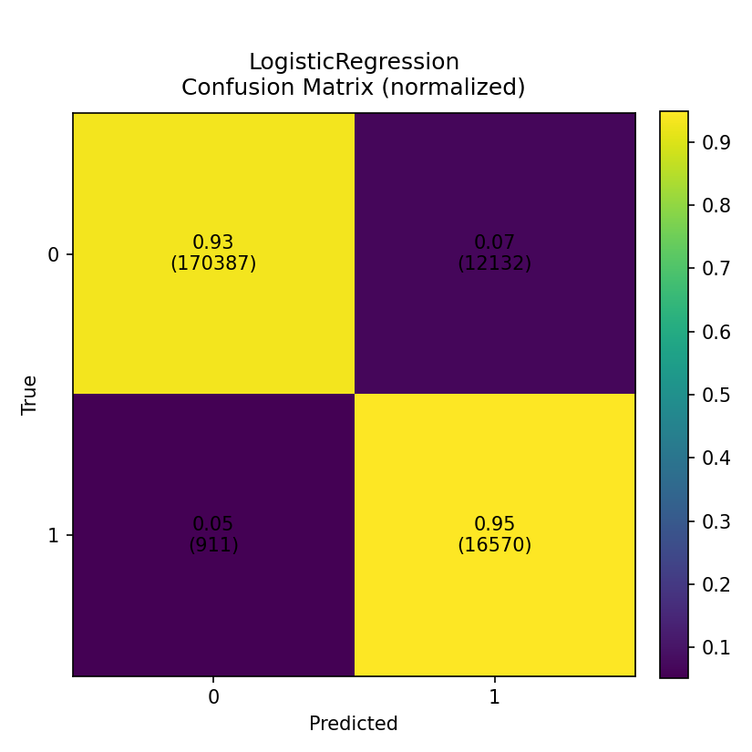

# 🧠 ML-Experiments 3 — Fraud Detection

## 📌 Overview
Interactive fraud-detection pipeline that lets you:
- Pick a **CSV** dataset via GUI (tested with `TestData.csv`)
- Choose the **target column** and the positive **label**
- Configure **preprocessing**, optional **sampling** (class_weight / SMOTE / undersampling), and select multiple **models**
- Generate metrics, plots, and a tidy results folder for your README

> **Metric focus:** `pr_auc`.  Best model: **rf** (pr_auc=1.0000)

---

## ⚙️ Environment & Requirements

- **Python version**: `3.12.x`
- Install dependencies:
  ```bash
  pip install -r requirements.txt
  ```

### `requirements.txt` includes:
```txt
pandas==2.2.3
numpy==1.26.4
matplotlib==3.9.0
scikit-learn==1.6.1
imbalanced-learn==0.13.0  # optional for SMOTE/undersampling
```
---

## 🧠 Classification Models
- **Logistic Regression** (`logreg`)
- **Random Forest** (`rf`)
- **K-Nearest Neighbors** (`knn`)
- **Decision Tree** (`dt`)
- **Gradient Boosting** (`gb`)
> ❌ SVC is available but excluded from the **Select All** option due to runtime.

---

## 🔁 Sampling Options
- `class_weight` (default) — no resampling, use built-in class weighting
- `SMOTE` — synthetic oversampling (requires `imbalanced-learn`)
- `RandomUnder` — random undersampling
- `None` — train as-is

> The app estimates imbalance and recommends PR-AUC where appropriate.

---

## 🧪 Run Configuration (example)
- Test size: `0.2`
- Random state: `42`
- Scaler: `True`
- Sampler used: `class_weight`
- Positive rate (sample): **8.71% (sample)**

---

## 📊 Performance Summary
(from `summary.tsv`)

| model | accuracy | precision | recall | f1 | pr_auc | roc_auc |
|---|---:|---:|---:|---:|---:|---:|
| rf | 1.0000 | 1.0000 | 0.9997 | 0.9999 | 1.0000 | 1.0000 |
| gb | 0.9996 | 0.9997 | 0.9954 | 0.9975 | 1.0000 | 1.0000 |
| dt | 1.0000 | 0.9999 | 0.9999 | 0.9999 | 0.9998 | 0.9999 |
| knn | 0.9987 | 0.9957 | 0.9895 | 0.9926 | 0.9995 | 0.9998 |
| logreg | 0.9348 | 0.5773 | 0.9479 | 0.7176 | 0.7574 | 0.9795 |

---

## ⏱️ Timings
(from `timings.json`)

| model | fit_seconds | predict_seconds |
|---|---:|---:|
| logreg | 0.5960 | 0.0030 |
| rf | 32.5240 | 0.3430 |
| gb | 200.5700 | 0.2490 |
| knn | 2.7440 | 46.3770 |
| dt | 2.5970 | 0.0120 |

---

## 🖼️ Visual Results

### Combined
  


### Confusion Matrices by Model
**DecisionTree**


**GradientBoosting**


**KNN**


**LogisticRegression**



**RandomForest**


---

## 🚀 How to Run
```bash
python Main.py
```
Then:
1. **Select dataset** (`.csv`) — e.g., `TestData.csv`  
2. Pick **target column** + **positive label**  
3. Choose **models**, **sampler**, and options  
4. Review the **summary**, start training, and collect results in `results/session_.../`

---

Created by: **Mesut Erkin Özokutgen**
